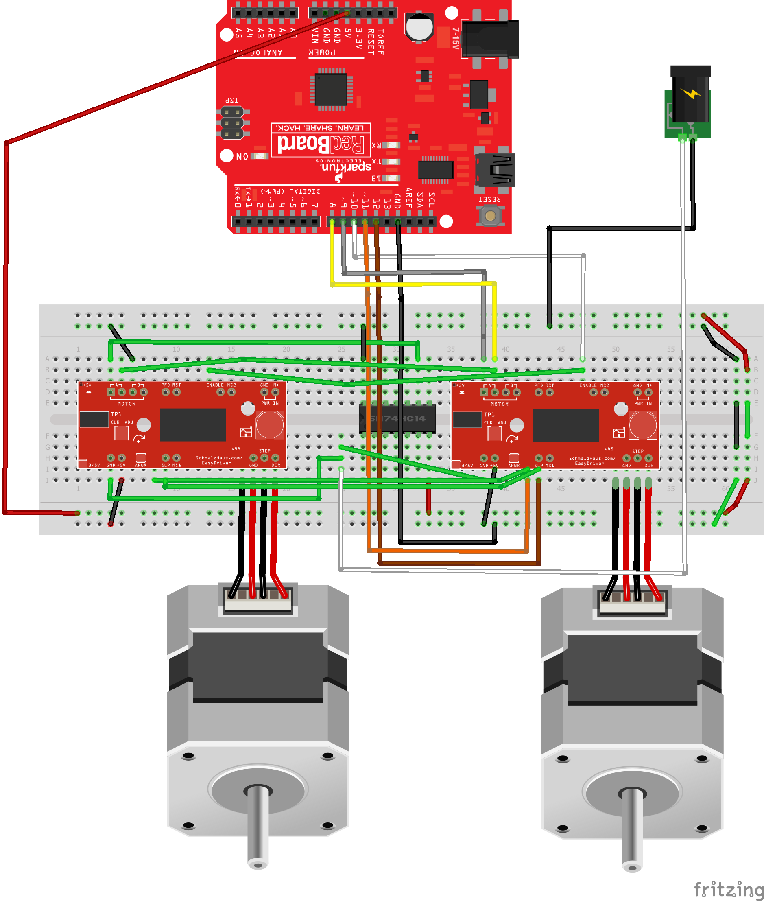
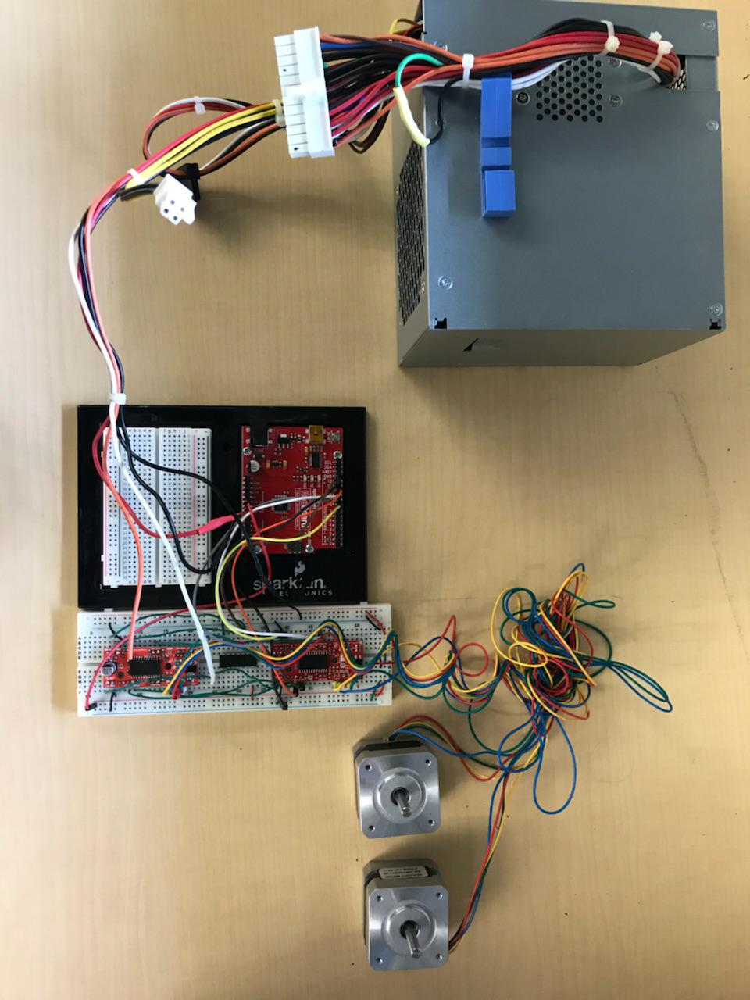
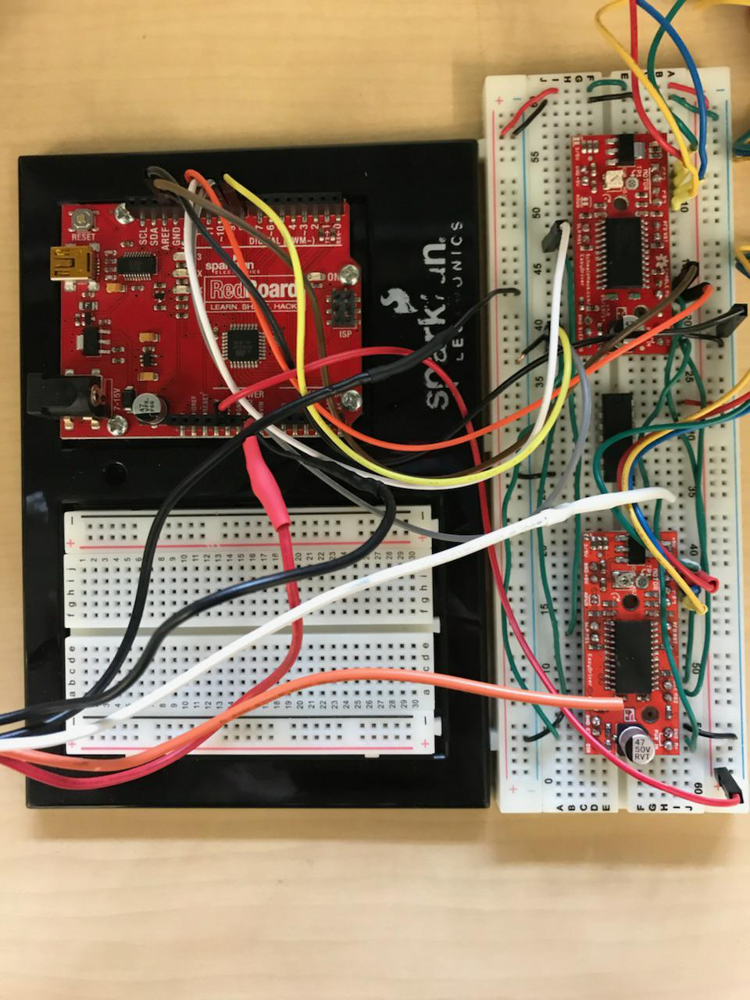

# Matlab_Car_Launcher
A car launcher ran on matlab as part of a project for ENGR114 at PCC
# Problem Statement:
Our group was tasked with building a launching mechanism for model cars to roll down a ramp.  This project will be primarily used to help the ENGR101 class with their group projects of building a car that fits in a shoebox and can be released from the provided ramp.  This project will use an Arduino as well as Matlab code and 3D printed gates to release the vehicles from a preset height at a consistent speed for all participants.
# Bill of materials:

Dell Power supply 	To power the set-up	model L305P
~30$-50$

Stepper motor drive X2	Connects the motor to the Arduino	Easy driver
14.95$

Stepper motor with cable X2	Moves the gates	motor
14.95$

Sparkfun redboard	Connecting to the computer program	Sparkfun redboard – programmed with arduino
19.95$

Hex Inverter	This allow the code to run backwards making less coding nessessary	Texas Instruments – hex inverter
<1$

Breadboard	For connecting between the parts	breadboard
4.95$

3D printed gates	These are attached to the motors and open and close	gates	Any gates would work	Cost of plastic for printer

# Hook-up guide: 
The first step was soldering the stepper motor drives together from the kits that they arrive in. After completion of soldering the Arduino was first connected to the first stepper motor drive shown in the fritzing diagram in the manner explained in the directions with the given wires. Then the two stepper motor drives were connected in a parallel series using the green wires.  After this a hex inverter was connected which allowed us to make the gates open in opposite directions without the need for additional coding.  After this step we connected the two motors to the stepper motor drives using the red and black wires and attached the 3D printed gates to the tops of the motors. At this point the power source and ground wires were connected to the Arduino. Finally the motors get mounted to the car ramp.

# Code:
The [countdown_final.m](countdown_final.m) script was run in MATLAB.

# Results:
We were successfully able to fulfill our problem statement by completing a gate that would release a car for the ENGR101 group project using the Arduino and matlab. We did this using various electronic parts as well as using 3D printed gates to hold the car until programing the gates to release.

# Future Work:
Future work for this project could be upgrading the motors being used for more speedy opening of the gate.  Also mounting multiple gates would allow for two cars to travel at once and race each other.  This could also be combined with some kind of censor that would track when the vehicle crossed a designated distance and that would allow the ENGR101 project to have a speed element as well as the total distance tracking that it currently has. Also, maybe designing the gates in a different way could potentially improve efficiency for example having them lift up instead of opening. 

# Special Acknowledgements:
Special thanks to Ethan Lew for his expertise in embedded systems interfacing, as well as Peter Kazarinoff, and Richard Dawes for providing the hardware needed for this project.
# License
GNU General Public License v3.0
